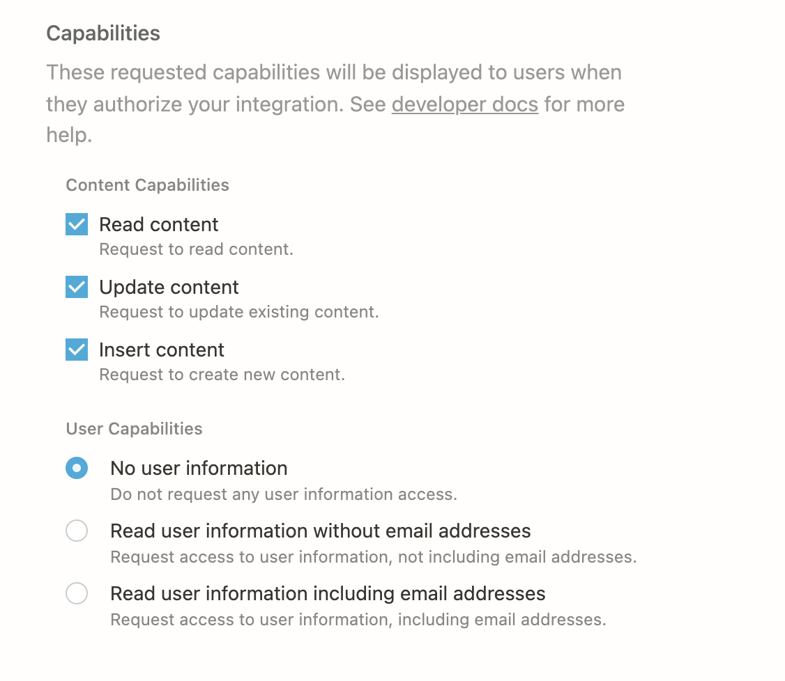

# Welcome to Notion DB Merger 👋


[](https://github.com/spofibo/notion-merge-dbs#readme)
[](https://github.com/spofibo/notion-merge-dbs/graphs/commit-activity)
[](https://github.com/spofibo/notion-merge-dbs/blob/master/LICENSE)

> Tool to help merge/sync one more databases to another

### 🏠 [Homepage](https://github.com/spofibo/notion-merge-dbs)

## Prerequisites

- node >=16.0.0
- npm >=8.3.0

## Install

```sh
npm install
```

## Usage

* Create an *internal* [Notion API key/integration](https://www.notion.so/my-integrations) with the following capabilities:

* Share the source database(s) with the newly created integration
* Create an empty target database and share it with the newly created integration
* Copy `.env.sample` to `.env` and fill in with the required parameters

```sh
node index.js
```

## Author

👤 **Alex Budurovici**

* Website: https://spofibo.com
* Github: [@spofibo](https://github.com/spofibo)

## 🤝 Contributing

Contributions, issues and feature requests are welcome!

Feel free to check [issues page](https://github.com/Spofibo/notion-merge-dbs/issues). You can also take a look at the [contributing guide](https://github.com/spofibo/notion-merge-dbs/blob/master/CONTRIBUTING.md).

## Show your support

Give a ⭐️ if this project helped you!


## 📝 License

Copyright © 2022 [Alex Budurovici](https://github.com/spofibo).

This project is [AGPL--3.0--or--later](https://github.com/spofibo/notion-merge-dbs/blob/master/LICENSE) licensed.

***
_This README was generated with ❤️ by [readme-md-generator](https://github.com/kefranabg/readme-md-generator)_